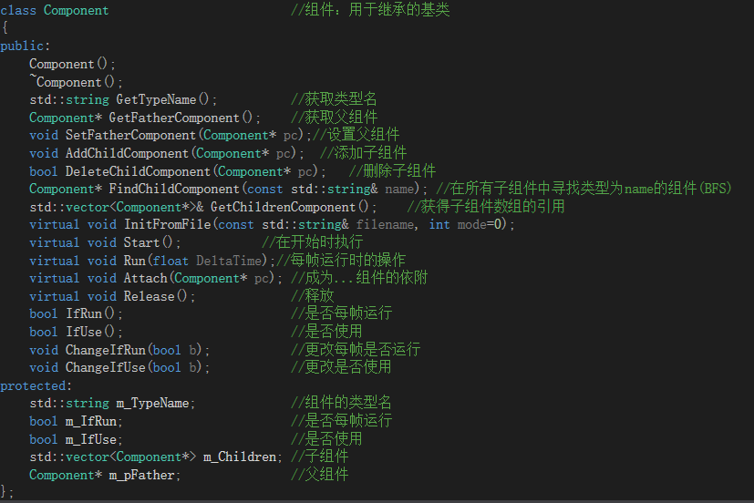
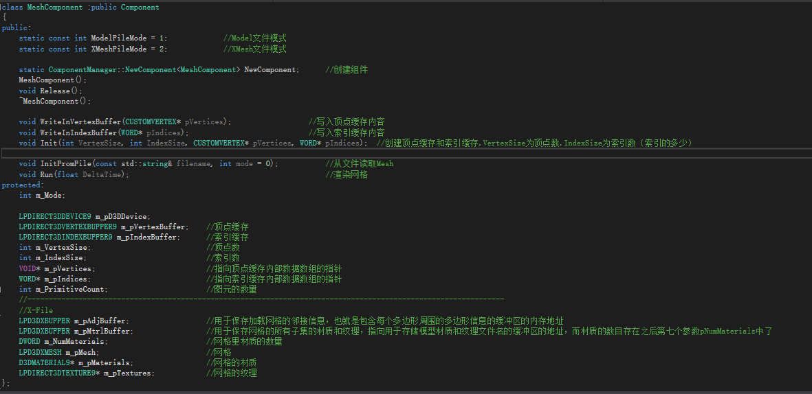

# Space Game Engine Helper
---
## Space基本组件Component类

>注意：在使用Component及其子类之前，确保你已经定义了一个Game对象和Scene对象。

>貌似图的字很小......没办法
### 1.概述
Component组件类是Space游戏引擎中执行动作的基本类。  
目前已有的大部分功能（比如：网格，材质，纹理，坐标...）都是由通过继承Component类来实现的。

### 2.如何使用
在接下来的***如何编写自己的组件***中我们将提到：在每个继承Component的类中都应当有这样的一个公共对象：
`static ComponentManager::NewComponent<子类名> NewComponent;`  

所以我们只需使用这个`NewComponent`伪函数即可获得一个该类型的Component对象指针。当然，你不需要去释放它。

例如：

	TransformComponent* transform=TransformComponent::NewComponent();
	//use transform to do something...

然后我们可以通过调用其的`GetTypeName()`来获取其的组件类型  

或是使用`IfUSe()`和`IfRun()`来得知这个组件是否会被引擎调用或是在每帧是运行。  
当然我们也可以使用`ChangeIfRun(bool b)`和`ChangeIfUse(bool b)`来设置这些属性。

>注意：在实际运用中，我们并不是单独的使用Component，而是将其绑定到Object对象中来由引擎调用。所以就不介绍它的初始化和运行了。

### 3.如何编写自己的组件
>这个才是本文档的重点，要注意的地方很多。

你先需要写一个类去继承Component类，然后你就可以在你的类中写代码了。

然而你需要注意的是以下这些需要被重载的函数及其作用。

* `构造函数`:  
重新初始化m_TypeName为你的组件类的名称，必须重写!!!
	
* `void InitFromFile(const std::string& filename,int mode)`:  
用来从文件中初始化组件，如果你不需要也可以不写。
	
* `void Start()`:  
由其实例在其所在场景***开始***时所执行的操作，如果你不需要也可以不写。
	
* `void Run()`:  
由其实例在其所在场景***每帧***时所执行的操作，如果你不需要也可以不写。

* `void Release()`:  
释放组件时的操作，如果你没有要释放的内容就不需要写。

除此之外，你还要在你的组件类中**加入**以下成员变量。

* 公有的`static ComponentManager::NewComponent<子类名> NewComponent`:  
用来创建一个组件类，并将其加入管理器，返回其指针。这是必须写的。

* 公有的`static const int`类型的各种`mode`:  
用来判断组件的内部具体模式（比如网格组件中分为model文件和XMesh文件两种mode）。对应`InitFromFile(const string& filename,int mode)`的`mode`形参。

* 私有的`int m_Mode`:  
对应上面提到的组件内部具体模式。

最后，你要在与带有该组件类声明的头文件对应的源文件中，加入以下的代码。

* 组件类的 `注册`:  
使用 `REGISTERCOMPONENTCLASS`宏来注册组件类，之后你便可以使用其的`NewComponent`和**反射创建组件**的功能了。 

这样你就可以构建自己的组件类了。

### 4.实例：（使用DX9的MeshComponent）

在图中你可以看到我上文所提到的那些方法和成员变量。